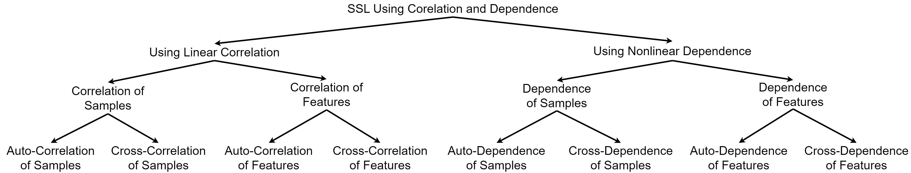

# CDSSL: Self-Supervised Learning Using Nonlinear Dependence



**CDSSL** is a general SSL framework that unifies linear *correlation* objectives (e.g., Barlow Twins / VICReg style) with nonlinear *dependence* via **HSIC** in RKHS. It introduces **8 complementary loss terms** across sample/feature × auto/cross × linear/nonlinear axes, yielding richer, less-redundant representations and stronger transfer. :contentReference[oaicite:0]{index=0}

---

## Highlights
- **Unified view of SSL:** Shows how VICReg, Barlow Twins, SimCLR/InfoNCE, and SSL-HSIC fit as **special cases** of CDSSL.  
- **Eight losses (overview):**
  - Linear correlation: L<sub>acs</sub>, L<sub>ccs</sub>, L<sub>acf</sub>, L<sub>ccf</sub>
  - Nonlinear dependence (HSIC): L<sub>ads</sub>, L<sub>cds</sub>, L<sub>adf</sub>, L<sub>cdf</sub>
- **Why HSIC?** Captures **nonlinear** sample/feature dependencies; maximizes informative spread (self-HSIC) and cross-view alignment while reducing redundancy.  
- **Results (ResNet-18 where applicable):**
  - Beats VICReg / Barlow Twins / SSL-HSIC / SimCLR on **MNIST, CIFAR-10, CIFAR-100, STL-10** linear eval; strong **nonlinear eval** (MLP) and **domain adaptation**; **ImageNet-100 kNN** trails only DINO by 0.7%.  

---

## Method (1-Minute Read)
CDSSL computes embeddings `z, z'` of two augmented views per image using an **encoder** and **expander**. It then applies:

- **Linear correlation terms** to (i) decorrelate non-matching samples/features and (ii) align corresponding ones.  
- **HSIC dependence terms** to (i) maximize self-HSIC (spread/variance) for samples/features and (ii) maximize cross-HSIC for corresponding pairs while reducing dependence under feature shuffles (anti-redundancy).

All eight terms combine with non-negative weights `λ_*` in the overall loss.

---

## Quick Start
> Minimal template (pseudo-config)

```python
# build encoder/expander -> z, z'
# normalize z, z' to unit length for HSIC terms (empirically helpful)

loss = (λ_acs*L_acs(z,z') + λ_ccs*L_ccs(z,z')
      + λ_acf*L_acf(z,z') + λ_ccf*L_ccf(z,z')
      + λ_ads*L_ads(z)    + λ_cds*L_cds(z,z')
      + λ_adf*L_adf(z)    + λ_cdf*L_cdf(z,z', shuffle_features=True))
loss.backward()
```
---


## Install

Using the provided Conda spec:

```bash
conda env create -f environment.yaml
conda activate cdssl
```

---
---

## Repository Overview (High-Level)

This codebase is organized for **clarity, reproducibility, and extensibility** rather than one-off scripts. At a high level:

- **Entry points**: `main.py` (standard datasets) and `main_imagenet.py` (larger-scale) orchestrate the end-to-end loop: data → two augmented views → encoder+expander → multi-term CDSSL loss → optimizer → checkpoints.
- **Configuration-first**: `config.yaml` is the single source of truth for datasets, model/backbone, optimizer, augmentation, and the eight CDSSL loss weights. Edit the config to define an experiment; the runners stay unchanged.
- **Separation of concerns**:
  - **Data & Augmentations**: utilities assemble two stochastic views per sample (SimCLR-style) so the method focuses on invariances/dependences rather than dataset plumbing.
  - **Backbone + Expander**: a standard vision backbone (e.g., ResNet-18) feeds a small projector (“expander”) head sized for correlation/HSIC statistics.
  - **Loss Layer**: linear correlation terms (variance/covariance alignment and redundancy reduction) and nonlinear dependence terms (HSIC in RKHS) are composed with non-negative weights into a single scalar objective.

## Training & Evaluation Workflow (Conceptual)

1. **Dual-view pipeline**: Each image is transformed into two semantically related but distributionally perturbed views.
2. **Representation building**: The encoder maps views to embeddings; the expander increases expressiveness for statistical alignment.
3. **Statistical alignment**:
   - *Linear* terms shape second-order structure (covariances/correlations) across samples and features.
   - *Nonlinear* terms shape higher-order dependencies via HSIC, capturing relationships linear metrics miss.
4. **Optimization & checkpoints**: Training logs the objective and writes periodic checkpoints compatible with downstream tasks.
5. **Downstream probes**: Separate scripts provide linear/kNN probes and unsupervised clustering to measure transfer without fine-tuning.

## Config-Driven Experiments (Philosophy)

- **One file, many runs**: Experiments are encoded in `config.yaml` to ensure runs are traceable, comparable, and easily shared.
- **Stable defaults**: Sensible kernels (RBF), standard backbones, and conservative optimizer settings reduce hyperparameter churn.
- **Minimal friction**: To try a new dataset or backbone, edit the config and (optionally) drop a small builder function—no runner rewrite.

## Extensibility (Design Intent)

- **New datasets**: add a dataset builder and update the config—dual-view logic remains intact.
- **New backbones**: register a model that returns an embedding dimension; the expander and loss layer adapt automatically.
- **New objectives**: plug additional correlation/HSIC variants or negatives into the loss composer without touching the training loop.

## Reproducibility & Logging (Practices)

- **Deterministic seeds** and **consistent batch statistics** make runs comparable.
- **Clear output structure** under `out_dir/` (checkpoints + logs) simplifies downstream evaluation and ablations.
- **Human-interpretable diagnostics** (e.g., covariance/HSIC heatmaps) help verify that the representation is spreading, aligning, and de-correlating as intended.

---
